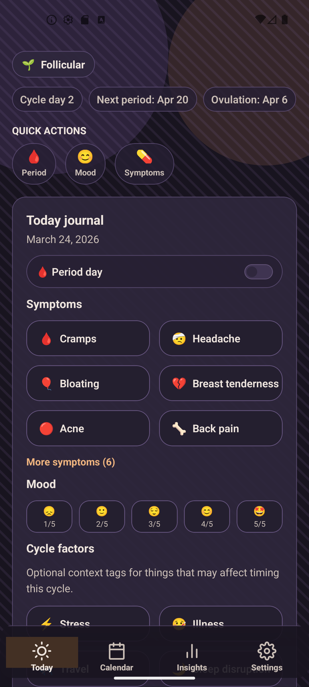
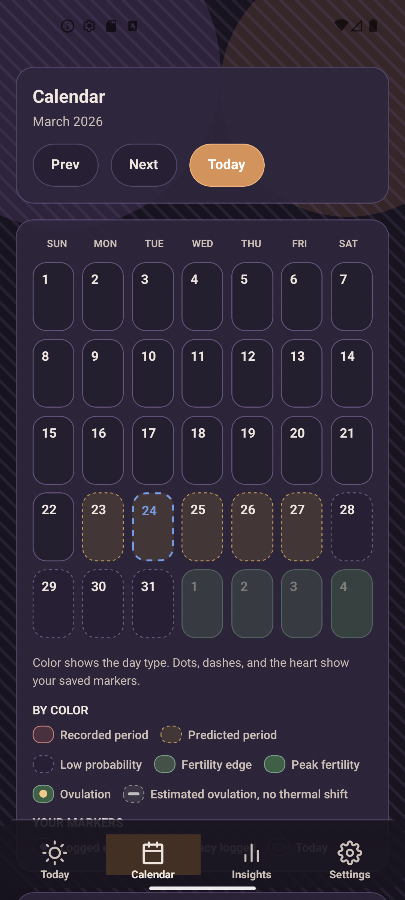
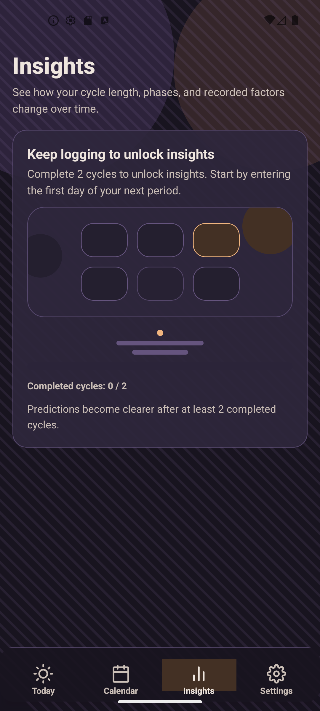
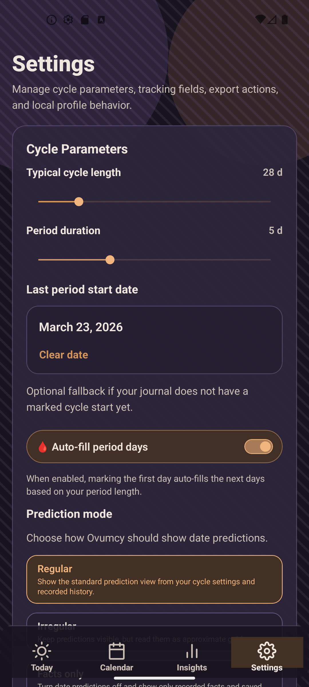
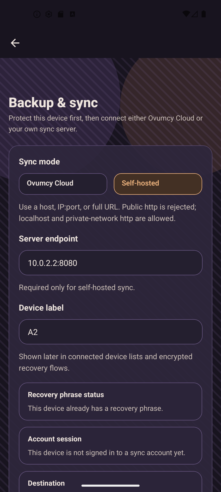

[](https://github.com/ovumcy/ovumcy-app/actions/workflows/ci.yml)
[](https://github.com/ovumcy/ovumcy-app/actions/workflows/security.yml)
[](https://github.com/ovumcy/ovumcy-app/actions/workflows/codeql.yml)
[](https://github.com/ovumcy/ovumcy-app)
[](https://expo.dev/)
[](https://reactnative.dev/)
[](https://www.gnu.org/licenses/agpl-3.0)
[](https://github.com/ovumcy/ovumcy-app)
[](https://github.com/ovumcy/ovumcy-app#privacy-and-security)
[](https://github.com/ovumcy/ovumcy-app#architecture)
[](https://github.com/ovumcy/ovumcy-app#privacy-and-security)

# Ovumcy App

Ovumcy App is the local-first mobile client for Ovumcy on iOS and Android.
It brings Ovumcy's cycle tracking, symptom logging, insights, settings, exports, and backup flows onto the device without making an account, sync, or managed hosting mandatory for core use.

Core health data stays on-device by default.
Optional sync is designed as encrypted transport, whether the owner connects a self-hosted community server or a managed Ovumcy Cloud account later.

## Product Snapshot

- local-first daily tracking with no account required for core use
- native encrypted-at-rest storage for privacy-sensitive health data
- dashboard, calendar, insights, settings, exports, and optional backup flows
- custom symptom catalog and journal-style day logging
- optional encrypted backup and sync instead of cloud-first dependence

## Screens

Dark-theme screenshots below were captured from the live Expo app on an Android emulator.

| Today | Calendar | Insights |
| --- | --- | --- |
|  |  |  |

| Settings | Backup & sync |
| --- | --- |
|  |  |

## How It Fits Into Ovumcy

- [`ovumcy-web`](https://github.com/ovumcy/ovumcy-web) is the canonical self-hosted web product.
- [`ovumcy-sync-community`](https://github.com/ovumcy/ovumcy-sync-community) is the optional self-hosted encrypted sync backend for the app.
- `ovumcy-app` is the mobile client that keeps the core experience usable even when sync is turned off.

## Current Status

This README describes the current `main` branch.
The app is still an early public alpha, but the main local-first slices already work on-device: onboarding, dashboard, calendar, insights, settings, custom symptoms, local export, encrypted-at-rest native storage, and optional backup/sync flows.

## How Ovumcy App Differs

| Capability | Ovumcy App | Ovumcy Web |
| --- | --- | --- |
| Works without an account | :white_check_mark: | :white_check_mark: |
| Local-first device storage | :white_check_mark: | :x: |
| Local encrypted sync setup | :white_check_mark: | Not applicable |
| Real self-hosted or managed sync transport | :white_check_mark: Alpha | Server-side product |
| iOS and Android client | :white_check_mark: | Browser only |
| Server required for core onboarding and tracking | :x: | :white_check_mark: |
| Optional sync architecture | :white_check_mark: | Not applicable |

## Short FAQ

### Does Ovumcy App require an account?

No. Core onboarding and future tracking flows are designed to work without an account.

### Where is the data stored?

On the device by default. Native platforms use a local SQLite-backed repository with encrypted-at-rest payloads for privacy-sensitive health records. Web preview uses a session-only in-memory adapter and should not be treated as durable secure storage for health data.

### Is sync required?

No. Core tracking stays local-first. Sync is optional. The app now supports self-hosted community sync and managed-cloud sync as alpha integrations, but core tracking does not depend on either.

### Can the sync server read health data?

The sync transport is designed so the server stores ciphertext, not readable health records. The server may still see account/session metadata, attached device metadata, blob-size metadata, and timestamps. See [docs/sync-trust-model.md](docs/sync-trust-model.md).

### Does Ovumcy App use telemetry or ad trackers?

No. The app is being built with no telemetry by default.

### Is Ovumcy App a medical product?

No. Ovumcy provides tracking and estimates based on recorded data. It is not a medical device and should not be treated as diagnostic or treatment advice.

## Current Scope

The current `main` branch provides:

- an Expo and React Native foundation for iOS and Android;
- a local-first onboarding flow with web-parity structure and copy;
- native SQLite-backed bootstrap, profile, symptom-catalog, and day-log persistence;
- local-first dashboard, calendar, settings, stats, custom symptom management, and export flows backed by the same canonical repositories;
- route, service, storage, and UI boundaries aligned with the long-term client architecture;
- baseline CI, security scanning, dependency automation, and browser smoke automation for the web shell.

## Public Alpha Expectations

`ovumcy-app` can now be reviewed publicly as an early alpha repository.

What is already true on `main`:

- core local use does not require an account, sync, or managed hosting;
- the main owner flows already exist as working local-first slices instead of shells;
- CI, browser smoke, and security automation baselines aligned with the current GitHub hosting mode are in place;
- web preview is available for fast review, but it is not the durable storage path for sensitive health data.

What this repository still does **not** claim yet:

- completed Android and iOS manual smoke discipline for every release candidate;
- App Store or Google Play billing integration for managed cloud sync;
- release-store readiness for broad end-user distribution;
- a standalone sync server in this repository.

## Privacy and Security

- No telemetry or ad trackers by default.
- Core onboarding and future tracking flows must work without sync or cloud access.
- Sensitive health baseline data is stored locally on-device.
- Native bootstrap, profile, day-log, and symptom data now live behind a SQLite-backed repository boundary with encrypted-at-rest payloads and secure local key storage.
- Web preview uses a non-persistent in-memory storage adapter so browser reloads do not retain health data as durable local storage.
- Local encrypted sync setup keeps non-secret preferences in canonical local storage and stores wrapped secrets only in secure storage.
- Self-hosted and managed sync transports are designed so health payloads are encrypted before upload. Sync servers should store ciphertext, device metadata, and auth/session metadata, not decrypted health content.
- Managed cloud auth and billing are a separate plane from sync transport. The sync endpoint should not become the place where email/password billing identity is handled.
- Local CSV, JSON, and PDF exports are privacy-sensitive artifacts and should be handled like health-data backups.
- Auth tokens, recovery secrets, and future sync credentials must not be stored in plain AsyncStorage or other broadly readable key/value stores.
- Security checks in GitHub Actions cover production dependency audit and Trivy filesystem scanning.
- CodeQL analysis is enabled while the repository remains public on GitHub.
- Dependabot monitors app dependencies and GitHub Actions updates.

## Architecture

```text
iOS App / Android App / Web Preview
                 |
                 v
          App Services Layer
                 |
                 v
         Local Storage Boundary
                 |
                 v
 Native SQLite / Web session-only memory storage

Future optional sync:
Local Sync Setup -> Account/Auth Transport -> Self-hosted or managed sync service
```

- `app/`: Expo Router route files and navigation only.
- `src/models/`: canonical domain types and product shapes.
- `src/services/`: reusable product logic and view-data assembly.
- `src/storage/`: local repositories, persistence contracts, and migrations.
- `src/ui/`: shared design tokens, components, and screen presentation.
- `src/sync/`: optional sync contracts, endpoint policy, and setup orchestration.

The app sync trust model is documented in [docs/sync-trust-model.md](docs/sync-trust-model.md).

## Tech Stack

- Expo
- React Native
- Expo Router
- TypeScript
- React Native Testing Library
- Playwright for temporary web-shell smoke

## Quick Start

Requirements:

- Node.js 22+
- npm
- Android Studio for Android emulator work
- Xcode on macOS for iOS simulator work

```bash
git clone https://github.com/ovumcy/ovumcy-app.git
cd ovumcy-app
npm ci
```

Run the app:

```bash
npm run android
npm run ios
npm run web
```

## Testing and Quality

Common local commands:

```bash
npm run lint
npm run typecheck
npm test
npm run doctor
npm run e2e:web
```

Current automated baseline:

- `lint`
- `typecheck`
- `jest` screen, service, and storage tests
- `expo-doctor`
- Playwright web smoke for onboarding and app shell
- production dependency audit
- Trivy filesystem scan
- Dependabot version updates for `npm` and `github-actions`

Deployment tooling:

- `npm run deploy` now uses the pinned local `eas-cli` version from the lockfile, not `@latest`.

Manual acceptance guidance lives in [docs/manual-smoke.md](docs/manual-smoke.md).

## Development

Recommended working model:

- implement product logic in `src/services/` and `src/models/`
- keep persistence in `src/storage/`
- keep route files thin
- use `ovumcy-web` as the canonical UX reference for core owner flows

## Roadmap

Near-term work focuses on:

- adding export-adjacent safety such as restore/import planning and clearer backup ergonomics;
- growing local data models beyond cycle baseline, day logs, and symptom catalog;
- adding repeatable Android and iOS smoke discipline;
- integrating managed cloud billing and entitlement sources without changing the zero-knowledge sync contract;
- continuing self-hosted and managed sync hardening without making sync mandatory.

## Related Repositories

- [`ovumcy-web`](https://github.com/ovumcy/ovumcy-web) — the self-hosted web and server product
- [`ovumcy-sync-community`](https://github.com/ovumcy/ovumcy-sync-community) — the self-hosted encrypted sync backend for Ovumcy app

## License

Ovumcy App is licensed under AGPL v3.
See [LICENSE](LICENSE).

