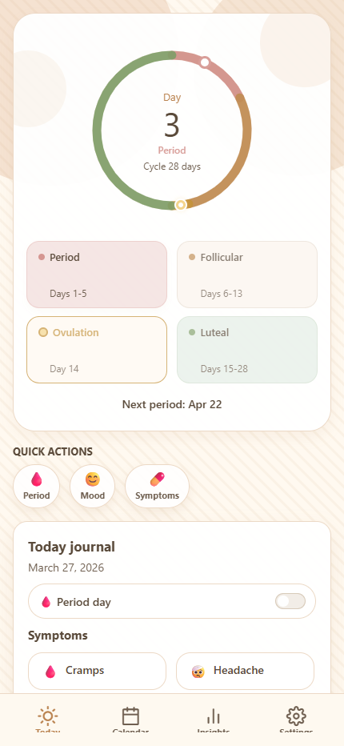
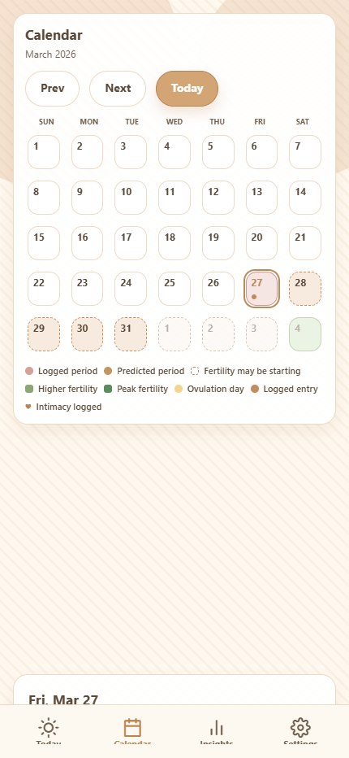
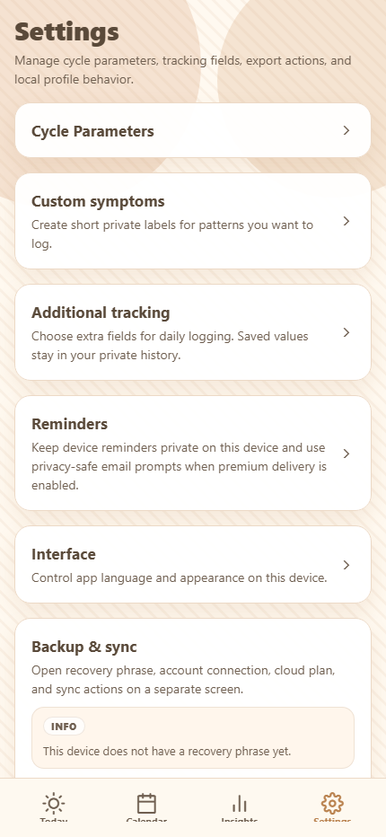
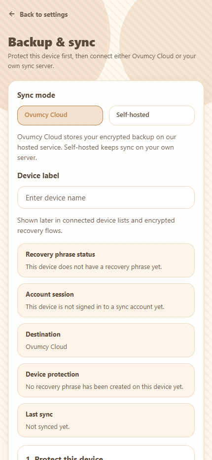

[](https://github.com/ovumcy/ovumcy-app/actions/workflows/ci.yml)
[](https://github.com/ovumcy/ovumcy-app/actions/workflows/security.yml)
[](https://github.com/ovumcy/ovumcy-app/actions/workflows/codeql.yml)
[](https://securityscorecards.dev/viewer/?uri=github.com/ovumcy/ovumcy-app)
[](https://app.codecov.io/gh/ovumcy/ovumcy-app)
[](https://github.com/ovumcy/ovumcy-app/blob/main/TESTING.md)
[](https://github.com/ovumcy/ovumcy-app)
[](https://expo.dev/)
[](https://reactnative.dev/)
[](https://polyformproject.org/licenses/noncommercial/1.0.0/)
[](https://github.com/ovumcy/ovumcy-app)
[](https://github.com/ovumcy/ovumcy-app#privacy-and-security)
[](https://github.com/ovumcy/ovumcy-app#architecture)
[](https://github.com/ovumcy/ovumcy-app#privacy-and-security)

# Ovumcy App

Ovumcy App is the local-first mobile client for Ovumcy on iOS and Android.
It brings Ovumcy's cycle tracking, symptom logging, insights, settings, exports, and backup flows onto the device without making an account, sync, or managed hosting mandatory for core use.

Core health data stays on-device by default.
Optional sync is designed as encrypted transport, whether the owner connects a self-hosted community server or a managed Ovumcy Cloud account later.

## Product Snapshot

- local-first daily tracking with no account required for core use
- native encrypted-at-rest storage for privacy-sensitive health data
- dashboard, calendar, insights, settings, exports, and optional backup flows
- custom symptom catalog and journal-style day logging
- pregnancy test field with automatic prediction pause on a positive result
- optional encrypted backup and sync instead of cloud-first dependence
- optional Ovumcy Cloud upgrade for advanced fertility signals, premium insights, doctor-friendly PDF, partner sharing, and reminders (push + email)

## Screens

Current light-theme mobile-view screenshots below reflect the latest dashboard, calendar, settings, and backup/sync UI contracts.

| Today | Calendar |
| --- | --- |
|  |  |

| Settings | Backup & sync |
| --- | --- |
|  |  |

## How It Fits Into Ovumcy

- [`ovumcy-web`](https://github.com/ovumcy/ovumcy-web) is the canonical self-hosted web product.
- [`ovumcy-sync-community`](https://github.com/ovumcy/ovumcy-sync-community) is the optional self-hosted encrypted sync backend for the app.
- Ovumcy Cloud is the managed hosted backend behind the paid tier (auth, billing, partner sharing).
- `ovumcy-app` is the mobile client that keeps the core experience usable even when sync is turned off.

## Tiers

Ovumcy is layered so each level adds capability without taking anything away from the one below.

| Tier | Backend | Cost | What you get |
| --- | --- | --- | --- |
| **Free (local)** | none | free | Core tracking, custom symptoms, pregnancy test, basic predictions, local CSV/JSON export |
| **Community Sync** | self-hosted `ovumcy-sync-community` | free, your hosting | Everything in Free + encrypted backup/restore between your own devices |
| **Ovumcy Cloud** | managed hosted service | paid, 30-day trial on signup | Everything above + advanced fertility signals, premium cycle insights, extended cycle reports, doctor-friendly PDF, partner sharing, premium reminders (email + push) |

Health data stays end-to-end encrypted across all three tiers. The cloud only sees opaque ciphertext, account session metadata, and billing snapshot signals.

## Current Status

This README describes the current `main` branch.
The app is still an early public alpha, but the main local-first slices already work on-device: onboarding, dashboard, calendar, insights, settings, custom symptoms, local export, encrypted-at-rest native storage, and optional backup/sync flows.

## How Ovumcy App Differs

| Capability | Free | Community Sync | Ovumcy Cloud |
| --- | --- | --- | --- |
| Works without an account | :white_check_mark: | :x: (server account) | :x: (cloud account) |
| Local-first device storage | :white_check_mark: | :white_check_mark: | :white_check_mark: |
| Cycle tracking + predictions | :white_check_mark: | :white_check_mark: | :white_check_mark: |
| Pregnancy test + auto-pause | :white_check_mark: | :white_check_mark: | :white_check_mark: |
| CSV / JSON export | :white_check_mark: | :white_check_mark: | :white_check_mark: |
| Encrypted backup between devices | :x: | :white_check_mark: | :white_check_mark: |
| Advanced fertility signals (LH, BBT shift, ovulation confirmation) | :x: | :x: | :white_check_mark: |
| Premium cycle insights (weighted average, drift, anomalies, seasonal, short luteal warning) | :x: | :x: | :white_check_mark: |
| Extended cycle reports | :x: | :x: | :white_check_mark: |
| Doctor-friendly PDF with colored calendar | :x: | :x: | :white_check_mark: |
| Partner sharing (one-way, read-only view for a free guest) | :x: | :x: | :white_check_mark: |
| Premium reminders (email + push) | :x: | :x: | :white_check_mark: |

## Short FAQ

### Does Ovumcy App require an account?

No. Core onboarding and future tracking flows are designed to work without an account.

### Where is the data stored?

On the device by default. Native platforms use a local SQLite-backed repository with encrypted-at-rest payloads for privacy-sensitive health records. Web preview uses a session-only in-memory adapter and should not be treated as durable secure storage for health data.

### Is sync required?

No. Core tracking stays local-first. Sync is optional. The app now supports self-hosted community sync and managed-cloud sync as alpha integrations, but core tracking does not depend on either.

### Can the sync server read health data?

The sync transport is designed so the server stores ciphertext, not readable health records. The server may still see account/session metadata, attached device metadata, blob-size metadata, and timestamps. See [docs/sync-trust-model.md](docs/sync-trust-model.md).

### Does Ovumcy App use telemetry or ad trackers?

No. The app is being built with no telemetry by default.

### Is there a free trial of Ovumcy Cloud?

Yes. Signing up for Ovumcy Cloud starts a 30-day trial that unlocks all premium features. The trial runs for roughly one cycle so the doctor PDF, advanced insights, and partner sharing can be evaluated on real data before any billing.

### How does partner sharing work?

Partner sharing is owner-paid only — the partner never pays and never tracks their own cycle through the share. The owner picks an access level (summary or full) in backup-and-sync settings and generates a single-use invite link, which can also be displayed as a QR code. The partner installs the app, opens the link or scans the QR, and lands in a read-only shared view shaped by the chosen access level — they see exactly what was shared, nothing more, and the cloud only stores ciphertext plus grant metadata.

Today the partner still completes one free Ovumcy Cloud sign-in step on first use so the cloud can route the right ciphertext to the right device; no card and no subscription are involved for that step. Removing even that sign-in step in favour of a pure-guest landing is a tracked roadmap item.

### Is Ovumcy App a medical product?

No. Ovumcy provides tracking and estimates based on recorded data. It is not a medical device and should not be treated as diagnostic or treatment advice.

## Current Scope

The current `main` branch provides:

- an Expo and React Native foundation for iOS and Android;
- a local-first onboarding flow with web-parity structure and copy;
- native SQLite-backed bootstrap, profile, symptom-catalog, and day-log persistence;
- local-first dashboard, calendar, settings, stats, custom symptom management, and export flows backed by the same canonical repositories;
- pregnancy test logging with automatic prediction pause when the latest test is positive and no subsequent period start has been recorded;
- Ovumcy Cloud premium gates with unified paywall placeholders for advanced fertility, advanced insights, extended reports, doctor PDF, partner sharing, and premium reminders;
- doctor-friendly PDF export with colored monthly calendar, advanced fertility signals, cycle comparison, and short luteal phase warning;
- five-locale interface coverage (English, Russian, German, French, Spanish) for paywall, day-log, calendar, dashboard, and PDF surfaces;
- route, service, storage, and UI boundaries aligned with the long-term client architecture;
- baseline CI, security scanning, dependency automation, and browser smoke automation for the web shell.

## Public Alpha Expectations

`ovumcy-app` can now be reviewed publicly as an early alpha repository.

What is already true on `main`:

- core local use does not require an account, sync, or managed hosting;
- the main owner flows already exist as working local-first slices instead of shells;
- Ovumcy Cloud premium gates are wired client-side with unified paywall placeholders, and the underlying premium analytics and doctor PDF sections render correctly when the managed billing snapshot reports premium features active;
- community sync and managed cloud sync round-trips have been validated end-to-end including the new pregnancy test field;
- CI, browser smoke, and security automation baselines aligned with the current GitHub hosting mode are in place;
- web preview is available for fast review, but it is not the durable storage path for sensitive health data.

What this repository still does **not** claim yet:

- completed Android and iOS manual smoke discipline for every release candidate;
- App Store or Google Play in-app purchase integration that drives a real Ovumcy Cloud subscription into the managed billing snapshot (premium UI is wired, the purchase path is not);
- a no-account guest landing for partner sharing — today the partner still needs an Ovumcy Cloud sign-in step before the read-only shared view opens;
- release-store readiness for broad end-user distribution;
- a standalone sync server in this repository.

## Privacy and Security

- No telemetry or ad trackers by default.
- Core onboarding and future tracking flows must work without sync or cloud access.
- Sensitive health baseline data is stored locally on-device.
- Native bootstrap, profile, day-log, and symptom data now live behind a SQLite-backed repository boundary with encrypted-at-rest payloads and secure local key storage.
- Web preview uses a non-persistent in-memory storage adapter so browser reloads do not retain health data as durable local storage.
- Local encrypted sync setup keeps non-secret preferences in canonical local storage and stores wrapped secrets only in secure storage.
- Recovery phrases are shown only during explicit local setup or rekey flows and are exported through an explicit local artifact flow instead of clipboard copy.
- Self-hosted and managed sync transports are designed so health payloads are encrypted before upload. Sync servers should store ciphertext, device metadata, and auth/session metadata, not decrypted health content.
- Managed cloud auth and billing are a separate plane from sync transport. The sync endpoint should not become the place where email/password billing identity is handled.
- Cloud accounts (managed and self-hosted) support optional TOTP two-factor authentication for login; enrollment, recovery, and the login challenge are described in [docs/two-factor.md](docs/two-factor.md).
- Local CSV, JSON, and PDF exports are privacy-sensitive artifacts and should be handled like health-data backups.
- Auth tokens, recovery secrets, and future sync credentials must not be stored in plain AsyncStorage or other broadly readable key/value stores.
- Security checks in GitHub Actions cover production dependency audit and Trivy filesystem scanning.
- CodeQL analysis is enabled while the repository remains public on GitHub.
- Dependabot monitors app dependencies and GitHub Actions updates.

## Architecture

```text
iOS App / Android App / Web Preview
                 |
                 v
          App Services Layer
                 |
                 v
         Local Storage Boundary
                 |
                 v
 Native SQLite / Web session-only memory storage

Future optional sync:
Local Sync Setup -> Account/Auth Transport -> Self-hosted or managed sync service
```

- `app/`: Expo Router route files and navigation only.
- `src/models/`: canonical domain types and product shapes.
- `src/services/`: reusable product logic and view-data assembly.
- `src/storage/`: local repositories, persistence contracts, and migrations.
- `src/ui/`: shared design tokens and visual primitives.
- `src/ui/screens/`: screen-level presentation and feature-local screen sections.
- `src/sync/`: optional sync contracts, endpoint policy, and setup orchestration.
- `src/security/`: device, secure-storage, and crypto policy for local-data, sync, and partner-share envelopes.
- `src/i18n/`: localized copy catalogs and the language runtime (en, ru, de, fr, es).

The app sync trust model is documented in [docs/sync-trust-model.md](docs/sync-trust-model.md).

## Tech Stack

- Expo
- React Native
- Expo Router
- TypeScript
- pdf-lib for client-side doctor PDF generation
- expo-sqlite for native local persistence
- @noble/ciphers (XChaCha20-Poly1305) for sync envelope encryption
- React Native Testing Library
- Playwright for temporary web-shell smoke

## Quick Start

Requirements:

- Node.js 22+
- npm
- Android Studio for Android emulator work
- Xcode on macOS for iOS simulator work

```bash
git clone https://github.com/ovumcy/ovumcy-app.git
cd ovumcy-app
npm ci
```

Run the app:

```bash
npm run android
npm run ios
npm run web
```

## Testing and Quality

Common local commands:

```bash
npm run lint
npm run typecheck
npm test
npm run doctor
npm run e2e:web
```

Current automated baseline:

- `lint`
- `typecheck`
- `jest` screen, service, and storage tests
- `fast-check` property tests for the payload and partner-share crypto (`src/security/*.property.test.ts`)
- live sync E2E round-trips (`src/sync/*.live.test.ts`) against the managed and self-hosted servers
- `expo-doctor`
- Playwright web smoke for onboarding and app shell
- production dependency audit
- Trivy filesystem scan
- Dependabot version updates for `npm` and `github-actions`

Deployment tooling:

- `npm run deploy` pins `eas-cli` to an explicit version via npx (`eas-cli@18.4.0`), not `@latest`. (eas-cli is not a project dependency, so it is not in the lockfile.)

Manual acceptance guidance lives in [docs/manual-smoke.md](docs/manual-smoke.md).

## Development

Recommended working model:

- implement product logic in `src/services/` and `src/models/`
- keep persistence in `src/storage/`
- keep route files thin
- use `ovumcy-web` as the canonical UX reference for core owner flows

## Roadmap

Done on `main`:

- Ovumcy Cloud premium tier wired client-side with paywall UX and six gated feature surfaces;
- pregnancy test logging with prediction pause across dashboard, calendar, and stats;
- doctor PDF with colored calendar and premium analytic sections (advanced fertility, cycle comparison, short luteal warning);
- partner sharing with summary and full access levels and 48-hour invite token TTL;
- community and managed sync transports validated end-to-end with the new fields.

Near-term:

- App Store and Google Play in-app purchase integration so a real subscription drives the managed billing snapshot;
- finishing the no-account guest acceptance flow so a partner can install the app and redeem an invite link straight into the read-only shared view without an Ovumcy Cloud sign-in step;
- TestFlight and Google Play internal-testing readiness so end-to-end premium can be validated on real devices with sandbox purchases;
- expanding export-adjacent safety such as restore/import planning and clearer backup ergonomics;
- repeatable Android and iOS manual smoke discipline per release candidate;
- growing local data models beyond cycle baseline, day logs, and symptom catalog without changing the zero-knowledge sync contract.

## Related Repositories

- [`ovumcy-web`](https://github.com/ovumcy/ovumcy-web) — the self-hosted web and server product
- [`ovumcy-sync-community`](https://github.com/ovumcy/ovumcy-sync-community) — the self-hosted encrypted sync backend for Ovumcy app
## License

Ovumcy App is source-available under the **PolyForm Noncommercial License 1.0.0**.
You may view, self-host, use, and modify it for any noncommercial purpose, and
share it noncommercially. Commercial use — selling it, offering it as a paid
service, or bundling it into a paid product — is not granted; contact Ovumcy for
a commercial license.
See [LICENSE](LICENSE).

Third-party attribution notices are recorded in [NOTICE.md](NOTICE.md).
